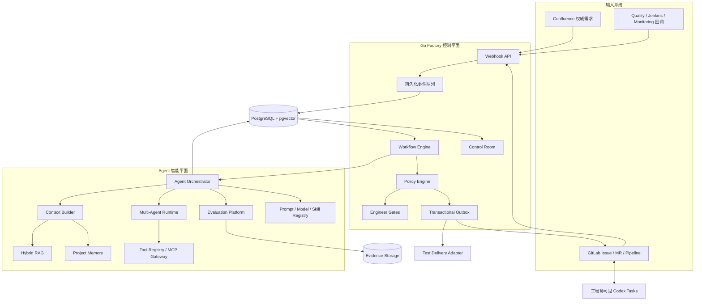

# AI SDLC Factory V3 设计总览

V3 将当前由确定性状态机编排的阶段型 Agent，扩展为一个可版本化、可检索、可评测、可治理的 Agent SDLC 平台。V3 不改变现有的核心安全边界：工作流状态、Engineer Gate、权限判断、外部写操作和发布授权仍由 Go Factory 控制；Agent 只能生成结构化候选结果，不能自行批准 Gate、提升权限或执行生产操作。

## 设计目标

- 为 Prompt、模型、上下文、工具调用和 Agent 输出建立完整版本与审计链。
- 支持 Confluence、GitLab、代码文档、质量报告和事故记录的混合检索。
- 引入受控的 Primary、Critic、Security Reviewer 和 Judge 多 Agent 协作。
- 通过 Tool Registry、MCP Gateway 和 Policy Engine 控制 Agent 工具权限。
- 支持历史 Workflow 重放、Prompt/模型对比、Shadow Run 和 Canary。
- 从 Gate 反馈、质量问题、发布失败和事故中生成受控的持续改进建议。
- 保持工程师可见的 Codex Coding 与独立 Quality Task，不运行无头 Coding Agent。

## 总体架构

## 文档导航

- [总体架构](architecture.md)：系统边界、运行组件、核心流程和部署拓扑。
- [Agent 平台](agent-platform.md)：Prompt、模型、上下文、多 Agent、Skills 与工具治理。
- [知识库与项目记忆](knowledge-and-memory.md)：Hybrid RAG、可信等级、索引和记忆生命周期。
- [数据模型](data-model.md)：新增实体、关系、迁移顺序和数据保留策略。
- [评测体系](evaluation.md)：历史重放、评分、Shadow、Canary 和持续改进。
- [安全设计](security.md)：权限边界、Prompt Injection、工具风险和生产锁定。
- [实施计划](implementation-plan.md)：阶段、验收标准、兼容策略和交付顺序。

## 不在 V3 范围内

- Factory Worker 无头运行 Codex 或其他 Coding Agent。
- Agent 自动批准自己的产物或 Engineer Gate。
- Agent 自动修改 Active Prompt、工具权限或永久项目记忆。
- 未经确定性 Policy 和 Engineer Gate 的生产部署或数据迁移。
- 在缺少评测数据和收益证明时进行模型 SFT、DPO 或 RL 训练。

## 完成定义

V3 完成不等于“代码路径存在”，而是至少满足：

1. 所有数据库迁移可在空库和现有 V2 数据库上成功执行。
2. 现有 V2 工作流语义保持兼容。
3. 每次 Agent Run 可追溯到模型、Prompt、Schema、Context Manifest 和工具调用。
4. RAG 输出的每条引用可回到来源版本和内容 Hash。
5. 多 Agent 的独立意见、共识和少数意见都可查询。
6. Tool Policy 能阻止越权、跨阶段和高风险自动调用。
7. Prompt 或模型升级必须经过离线评测、人工审批和 Shadow/Canary。
8. 本地 Compose 与测试 Kubernetes 环境均能完成端到端验收。

