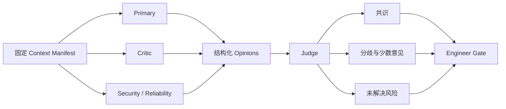

# V3 Agent 平台设计

## Agent Profile

V3 使用版本化 Agent Profile 替代散落在代码中的角色配置。一个 Profile 绑定：

- Agent 类型与职责。
- Prompt 版本。
- 输出 Schema 版本。
- 模型策略。
- 可用 Skill。
- 可请求工具。
- Context 策略。
- Token、费用、工具次数和时间预算。
- 是否允许参与 Judge 或 Critic 流程。

内置 Profile 包括：

- Requirement Primary、Critic、Security Reviewer、Judge。
- PRD Primary、Critic、Judge。
- Test Primary、Coverage Critic、Judge。
- Architecture Primary、Critic、Reliability Reviewer、Security Reviewer、Judge。
- Quality Evidence Reviewer、Release Risk Reviewer、Incident Reviewer。

## Prompt Registry

Prompt 版本状态为：

```text
DRAFT -> EVALUATING -> APPROVED -> ACTIVE -> RETIRED
```

约束：

- Active Prompt 内容不可修改，只能发布新版本。
- Prompt 必须绑定输出 Schema。
- Prompt 升级必须引用 Evaluation Run。
- 高风险 Agent 的 Prompt 激活需要 Engineer Approval。
- Agent 只能生成 Prompt 改进建议，不能直接激活。

## Model Registry 与路由

Model Registry 保存 Provider、模型标识、能力、上下文上限、结构化输出支持、价格、超时和评测状态。Model Policy 根据 Agent 类型、风险、预算和 Provider 健康度选择模型。

高风险规则：

- Requirement、Architecture、Code Review 和 Release Judge 不允许静默降级。
- Judge 默认不得与 Primary 使用完全相同的 Profile；是否要求不同 Provider 由项目配置决定。
- 模型切换必须记录实际 Provider 返回的模型 ID。
- 只有通过对应 Evaluation Suite 的模型才能成为 Active 候选。

## Context Builder

Context 被划分为：

1. **System Policy**：固定安全和角色规则。
2. **Authoritative Evidence**：Confluence 快照、已批准 Artifact、精确 MR SHA。
3. **Approved Memory**：经过批准的项目记忆。
4. **Retrieved Evidence**：按需检索的历史资料。
5. **Engineer Feedback**：当前 Gate 的明确反馈。

Context Manifest 保存每个条目的来源、版本、Hash、可信等级、是否必需、压缩方式和 Token 估算。压缩不能覆盖权威原文；被压缩内容必须保留原始来源引用。

## 多 Agent 协作

V3 默认使用“独立分析 + Judge”拓扑，不允许无界自由讨论。



每个成员拥有独立 Agent Run。Critic 只能读取 Primary 的正式产物，不读取隐藏推理。Judge 必须保留少数意见，不得只输出单一结论。

## Agent Skills

Skill 是版本化、可评测的领域指令包，包含：

- 触发条件。
- 适用 Agent Profile。
- 必需输入。
- 工作步骤。
- 输出约束。
- 正反示例。
- 安全限制。
- Evaluation Cases。

首批 Skill：

- Requirement Completeness Review。
- API Design Review。
- Database Migration Review。
- Threat Modeling。
- Go Service Review。
- Kubernetes Review。
- Test Coverage Review。
- Incident Analysis。

运行时只从项目允许列表中发现 Skill。Skill 内容进入 Context Manifest，不允许从不可信文档动态安装或执行。

## Tool Registry 与 MCP Gateway

工具定义包括：

- 名称、版本和描述。
- 输入/输出 JSON Schema。
- 风险等级。
- 允许的 Agent、Workflow State 和项目。
- 是否只读、是否幂等、是否可恢复。
- 超时、速率、调用次数和费用预算。
- 所需凭据的引用；凭据本身不进入 Agent Context。

风险等级：

| 等级 | 示例 | 执行策略 |
|---|---|---|
| L0 | 内部格式化、Token 估算 | 自动执行 |
| L1 | 搜索 Confluence、GitLab、代码索引 | Policy 校验后自动执行 |
| L2 | 更新 GitLab 评论、创建 Issue | Transactional Outbox |
| L3 | 触发 Staging、修改共享测试资源 | Engineer Gate |
| L4 | 生产部署、生产迁移 | 独立 Gate，默认禁用 |

MCP 是工具通信协议，不承担最终授权。Tool Gateway 收到请求后仍必须经过 Factory Policy Engine。

## Agent Run 生命周期

```text
CREATED -> CONTEXT_BUILDING -> RUNNING -> VALIDATING
        -> COMPLETED
        -> RETRYABLE_FAILED
        -> TERMINAL_FAILED
        -> CANCELLED
```

Run 完成必须同时满足：模型响应完成、JSON Schema 校验通过、引用可验证、工具调用结算完成、使用量已记录。

