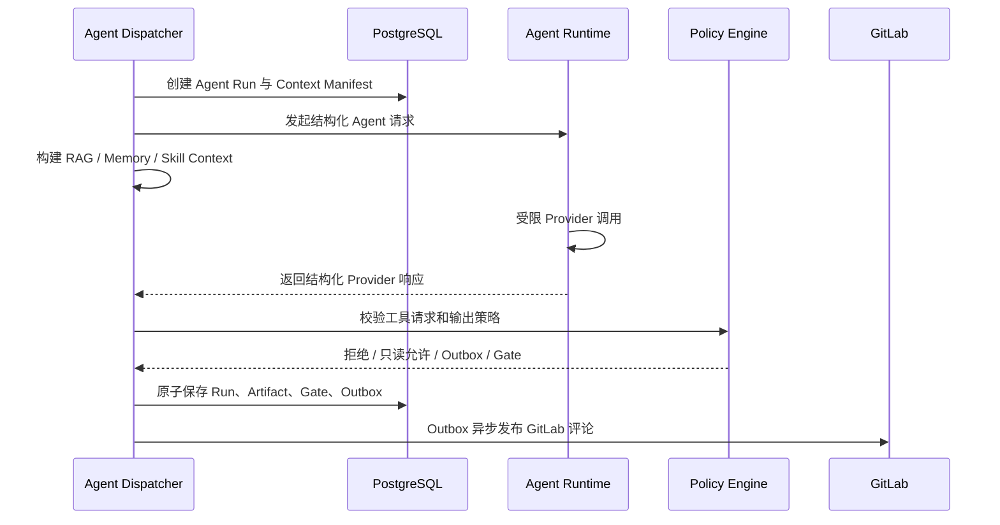
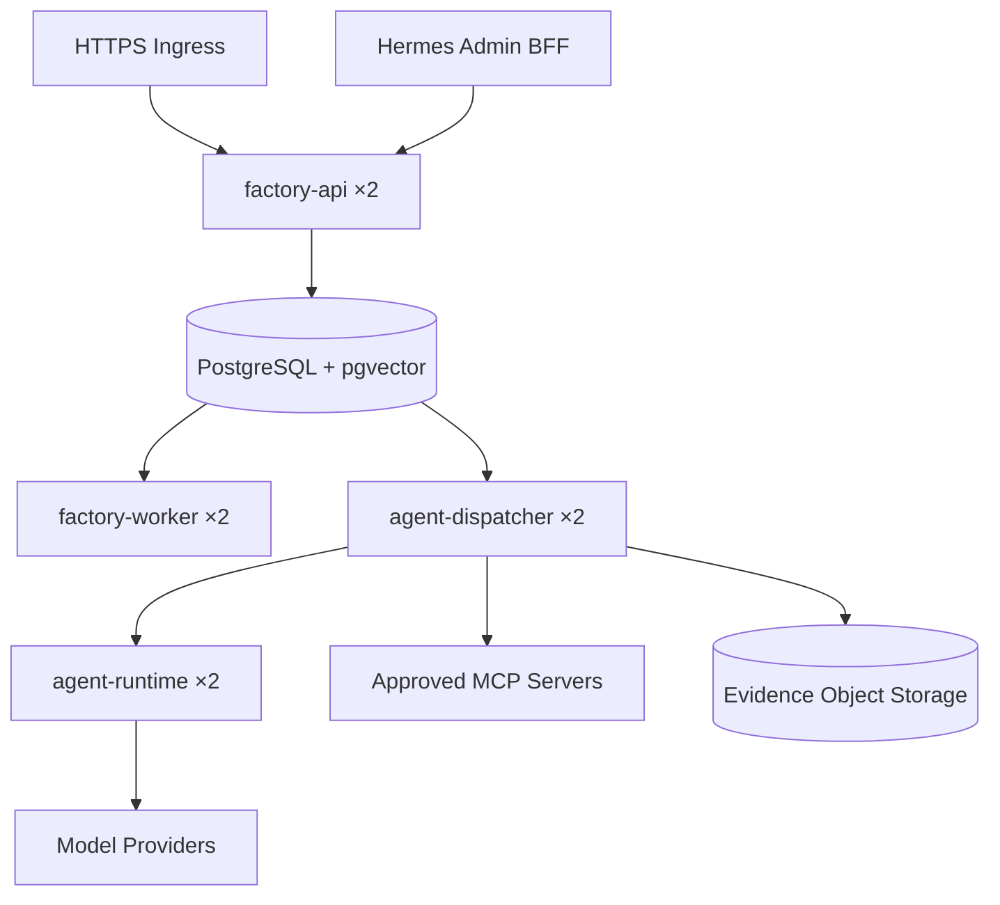

# V3 总体架构

## 架构原则

V3 采用“确定性控制平面 + 受限智能平面”的架构。

- **控制平面**拥有工作流状态、授权、Gate、外部写操作和发布决定。
- **智能平面**负责分析、检索、压缩、评审和生成候选产物。
- 智能平面不能直接修改工作流状态，也不能直接持有 GitLab、Kubernetes 或生产凭据。
- 所有非幂等外部写操作继续通过 Transactional Outbox 执行。
- 所有高风险行为继续绑定不可变证据和 Engineer Gate。

## 运行组件

### factory-api

延续现有职责：验证 GitLab Webhook 与 Callback Secret，限制请求大小，标准化事件并持久化后返回。V3 新增只读查询接口，用于 Dashboard 查看 Prompt、模型、Context、检索、评测和多 Agent 轨迹。

### factory-worker

继续消费 Intake、Gate、交付和事故事件以及 `outbox_messages`，负责确定性工作流编排和外部写操作。

### agent-dispatcher

消费 Requirement、Planning 和 Architecture 智能任务；解析受治理的 Prompt、Profile、Context Manifest、RAG、Memory 与 Skills，创建 Agent Run，然后通过 Agent Runtime API 执行模型调用。Dispatcher 持有受限数据库角色，但不持有模型 Provider、GitLab、Confluence、Callback 或交付凭据。

### agent-runtime

独立的无状态模型执行服务，负责 Provider 适配、结构化输出约束、请求幂等、响应大小限制、超时和凭据隔离。它不持有工作流数据库、GitLab、Confluence、Callback、交付或 Kubernetes 凭据。Context、RAG、多 Agent、MCP Policy 和评测编排仍由有证据存储能力的 Factory Dispatcher/Worker 完成。

Agent Runtime 只能返回结构化结果和工具请求。需要写外部系统时，由 Factory Policy Engine 决定自动拒绝、通过 Outbox 执行或打开 Engineer Gate。

### knowledge-indexer

负责将已允许的数据源标准化并写入知识索引。第一版可作为 Agent Runtime 的后台进程，规模增长后再拆成独立 Deployment。

### evaluation-worker

负责异步运行历史重放、Prompt/模型对比和批量评分。评测工作使用固定输入快照，不得修改真实 Workflow。

## 服务契约

Factory 使用内部 Bearer Secret 调用 `POST /responses`，并发送稳定的 `Idempotency-Key: <agent-run-id>:<schema-name>`。请求遵循受限 Responses 契约：

```json
{
  "model": "registry-selected-model",
  "instructions": "resolved governed prompt",
  "input": "context assembled from immutable evidence",
  "store": false,
  "max_output_tokens": 12000,
  "safety_identifier": "non-reversible run identifier",
  "text": {"format": {"type": "json_schema", "name": "architecture_v3", "strict": true, "schema": {}}}
}
```

Runtime 拒绝缺失幂等键、`store=true`、非严格 JSON Schema、超预算输出或未鉴权请求。它使用 Provider Credential 替换内部凭据，把相同幂等键继续传给 Provider，并在实例内复用已完成响应；Factory 负责解析 Provider 响应并把实际模型、Token、费用、延迟和输出绑定到 Agent Run。

## 工作流集成



## 失败与恢复

- Factory 事件仍使用 Lease、Attempt、指数退避和 Dead Letter。
- Agent Runtime 请求必须携带由 Agent Run ID 和 Schema 名组成的幂等键。
- 相同幂等键但不同请求 Hash 会被拒绝；同实例重试返回缓存结果，跨实例重试依赖继续透传给 Provider 的幂等键。
- 外部模型超时、限流和格式错误需要分别分类。
- Agent Runtime 不得在超时后继续执行高成本调用。
- Context Manifest 创建后不可修改；重试可复用同一 Manifest。
- 如果 Prompt、模型或上下文改变，必须创建新的 Agent Run。

## 部署拓扑



测试环境 Ingress 继续只暴露精确 Webhook 与 Callback 路径。Dashboard 仍通过管理员 BFF 或 `kubectl port-forward` 访问。
