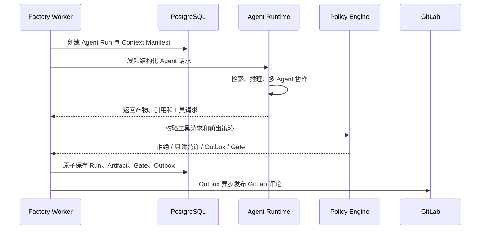
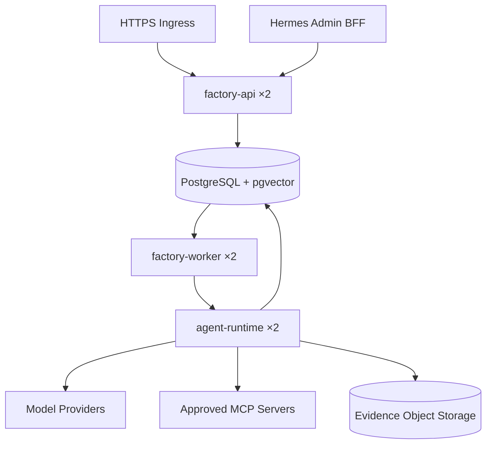

# V3 总体架构

## 架构原则

V3 采用“确定性控制平面 + 受限智能平面”的架构。

- **控制平面**拥有工作流状态、授权、Gate、外部写操作和发布决定。
- **智能平面**负责分析、检索、压缩、评审和生成候选产物。
- 智能平面不能直接修改工作流状态，也不能直接持有 GitLab、Kubernetes 或生产凭据。
- 所有非幂等外部写操作继续通过 Transactional Outbox 执行。
- 所有高风险行为继续绑定不可变证据和 Engineer Gate。

## 运行组件

### factory-api

延续现有职责：验证 GitLab Webhook 与 Callback Secret，限制请求大小，标准化事件并持久化后返回。V3 新增只读查询接口，用于 Dashboard 查看 Prompt、模型、Context、检索、评测和多 Agent 轨迹。

### factory-worker

继续消费 `event_queue` 和 `outbox_messages`，负责确定性工作流编排。V3 中它通过 Agent Runtime API 发起智能任务，但不把工作流数据库连接或外部写凭据交给 Agent Runtime。

### agent-runtime

新增独立服务，建议使用 Python 实现，负责：

- 模型 Provider 适配。
- Context 构建和压缩。
- Hybrid RAG 与 Reranker。
- 多 Agent 并行与 Judge 汇总。
- MCP Client 和只读工具调用。
- 评测 Scorer 与 LLM Judge。

Agent Runtime 只能返回结构化结果和工具请求。需要写外部系统时，由 Factory Policy Engine 决定自动拒绝、通过 Outbox 执行或打开 Engineer Gate。

### knowledge-indexer

负责将已允许的数据源标准化并写入知识索引。第一版可作为 Agent Runtime 的后台进程，规模增长后再拆成独立 Deployment。

### evaluation-worker

负责异步运行历史重放、Prompt/模型对比和批量评分。评测工作使用固定输入快照，不得修改真实 Workflow。

## 服务契约

Factory 调用 Agent Runtime 时发送：

```json
{
  "run_id": "uuid",
  "workflow_id": "uuid",
  "agent_profile_version_id": "uuid",
  "prompt_version_id": "uuid",
  "model_policy_id": "uuid",
  "context_manifest_id": "uuid",
  "output_schema_name": "architecture.v3",
  "budget": {
    "max_input_tokens": 100000,
    "max_output_tokens": 12000,
    "max_tool_calls": 8,
    "deadline_seconds": 300
  }
}
```

Agent Runtime 返回：

```json
{
  "status": "COMPLETED",
  "model_version_id": "uuid",
  "prompt_content_hash": "sha256",
  "context_content_hash": "sha256",
  "output": {},
  "usage": {
    "input_tokens": 0,
    "cached_tokens": 0,
    "output_tokens": 0,
    "reasoning_tokens": 0,
    "latency_ms": 0
  },
  "citations": [],
  "tool_requests": [],
  "warnings": []
}
```

## 工作流集成



## 失败与恢复

- Factory 事件仍使用 Lease、Attempt、指数退避和 Dead Letter。
- Agent Runtime 请求必须携带幂等 `run_id`。
- 同一个 `run_id` 的重复请求返回已保存结果，不重复计费。
- 外部模型超时、限流和格式错误需要分别分类。
- Agent Runtime 不得在超时后继续执行高成本调用。
- Context Manifest 创建后不可修改；重试可复用同一 Manifest。
- 如果 Prompt、模型或上下文改变，必须创建新的 Agent Run。

## 部署拓扑



测试环境 Ingress 继续只暴露精确 Webhook 与 Callback 路径。Dashboard 仍通过管理员 BFF 或 `kubectl port-forward` 访问。

