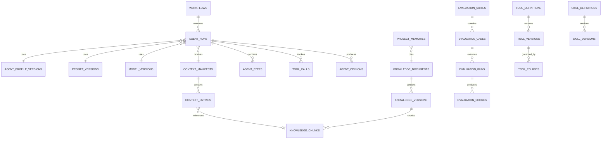

# V3 数据模型

## 关系概览

## Registry 表

### prompt_definitions / prompt_versions

保存 Prompt 的稳定标识和不可变版本。版本包含内容、Schema 引用、Hash、状态、创建人、批准人和关联 Evaluation Run。

### model_providers / model_versions / model_policies

保存 Provider 配置引用、模型能力和路由策略。Provider Secret 只保存在 Secret Manager 或 Kubernetes Secret 中，数据库只保存 Secret Reference。

### agent_profiles / agent_profile_versions

绑定 Prompt、模型策略、Skill、工具权限、Context 策略和运行预算。

### skill_definitions / skill_versions

保存 Skill 的版本内容、触发规则、适用范围、Hash 和评测状态。

## Agent 运行表

扩展 `agent_runs`，新增：

- `agent_profile_version_id`
- `prompt_version_id`
- `model_version_id`
- `context_manifest_id`
- `provider_response_id`
- `input_tokens`、`cached_tokens`、`output_tokens`、`reasoning_tokens`
- `estimated_cost_microunits`
- `latency_ms`
- `finish_reason`
- `cancel_requested_at`

新增 `agent_steps` 记录多轮检索、工具请求和 Judge 阶段；`agent_opinions` 保存多 Agent 的独立结论、共识和少数意见。

## Context 与知识表

- `context_manifests`：一次模型调用的不可变上下文集合及总 Hash。
- `context_entries`：具体来源、可信等级、顺序、压缩方式和 Token 数。
- `knowledge_documents`：稳定来源标识和权限范围。
- `knowledge_versions`：来源版本、Hash、抓取时间和状态。
- `knowledge_chunks`：分块文本、向量、全文索引字段和父级路径。
- `retrieval_runs` / `retrieval_results`：查询、过滤、分数、选择和排除原因。
- `project_memories`：受治理的项目记忆及生命周期。

## 工具表

- `tool_definitions` / `tool_versions`：Schema、风险等级和执行适配器。
- `tool_policies`：项目、Agent、Workflow State 与风险策略。
- `tool_calls`：输入 Hash、决策、审批引用、结果 Hash、时间和错误。

工具输入中可能出现敏感字段时，只保存经过字段级脱敏的审计视图和完整 Payload Hash。

## 评测表

- `evaluation_suites`：目标 Agent 和通过规则。
- `evaluation_cases`：固定输入、期望属性、黄金证据和数据切分。
- `evaluation_runs`：候选 Prompt/模型/Profile 与运行状态。
- `evaluation_outputs`：结构化输出和 Artifact 引用。
- `evaluation_scores`：Scorer、维度、分数、证据和版本。
- `evaluation_comparisons`：基线与候选的成对结果及显著性信息。

## 迁移顺序

1. 新增 Registry 和 Context 表，不修改现有读取路径。
2. 为现有 Agent Run 增加可空外键和使用量字段。
3. 双写旧字段与新 Registry 引用。
4. 回填当前 Prompt、模型和 Agent Profile 版本。
5. 新读取路径切换到 Registry。
6. 新增知识、工具和评测表。
7. 在至少一个完整发布周期后评估是否废弃旧自由文本字段。

所有迁移必须幂等、事务化，并继续使用 PostgreSQL Advisory Lock。

