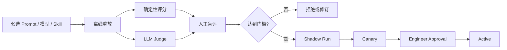

# V3 Agent 评测与持续改进

## 目标

评测平台回答三个问题：新 Prompt 或模型是否更好、是否更安全、是否值得增加的成本。评测不得修改真实 Workflow，也不得使用测试集结果反向污染测试数据。

## Evaluation Case 来源

- 经过 Engineer Gate 的历史 Workflow。
- 被 Request Changes 或 Reject 的失败样例。
- Quality Finding、回滚和 Incident。
- 人工构造的权限、Prompt Injection、重复事件和边界用例。
- 脱敏后的合成需求。

数据切分为 Development、Validation 和 Holdout。Holdout 不用于 Prompt 编写或自动改进建议生成。

## 评分层

### 确定性评分

- JSON Schema 是否通过。
- 必需引用是否存在。
- 每条验收标准是否被测试映射。
- Work Item 依赖是否有效。
- 是否出现未授权工具请求。
- 是否违反生产锁和 Gate 规则。

### LLM Judge

用于评估完整性、清晰度、风险发现和方案质量。Judge Prompt 与模型必须版本化，且输出评分必须带逐维证据。

### 人工盲评

高风险 Prompt、模型和 Judge 变更需要匿名成对比较。评审者不应看到 Provider、模型名称或候选版本标签。

## 发布流程

Shadow Run 只能读取真实输入并生成隔离产物，不能创建 Gate、Issue、MR 或部署。Canary 的范围由项目配置明确限定，并支持即时回滚到上一版本。

## 核心指标

- Requirement：事实/推断区分、阻塞问题发现、验收标准可测试性、拆分合理性。
- PRD：需求追踪、数据契约、依赖、范围和可观测性完整度。
- Test：验收覆盖、边界、权限、并发、幂等、重试、回滚和清理覆盖。
- Architecture：约束遵守、安全、迁移、回滚、实施映射和虚构率。
- 运行：Schema 失败率、超时率、重试率、Token、费用、延迟和稳定性。
- 治理：越权工具请求率、Gate 修改率、引用错误率和人工覆盖率。

## 持续改进

系统可将 Gate Feedback、Quality Finding、失败 Pipeline 和 Incident 聚类，生成以下候选：

- Prompt 修改建议。
- 新 Skill 或 Skill 修订建议。
- 检索策略调整建议。
- 新 Evaluation Case。
- 项目记忆候选。

每个候选必须包含来源、影响范围、预期改进、风险和建议评测集。系统不得自动激活候选。

## 防止评测污染

- 测试数据不得进入 RAG 生产索引。
- Holdout 输入不得进入 Prompt 自动生成上下文。
- Judge 不得看到候选身份。
- 失败 Case 的修改历史必须保留。
- 相同 Case 的多次运行必须记录随机性参数和 Provider 实际模型 ID。

