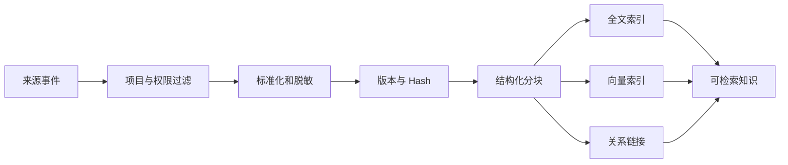

# V3 知识库与项目记忆

## 目标

知识层为 Agent 提供可追溯的补充证据，但不得改变权威来源的优先级。Issue 明确引用的 Confluence 页面仍是需求权威；历史 Issue、MR、事故和 Agent 推断只能作为补充。

## 数据源

- Confluence 页面和嵌入附件。
- GitLab Issue、MR、Pipeline 和代码评审记录。
- 仓库内 README、架构文档、API 契约和迁移文件。
- 已批准的 Requirement、PRD、Test 和 Architecture Artifact。
- Quality Finding、发布验证、回滚和 Incident。
- 经过 Engineer Approval 的项目记忆。

## 可信等级

| 等级 | 含义 |
|---|---|
| AUTHORITATIVE | 当前 Workflow 指定的权威来源 |
| APPROVED | 经过有效 Engineer Gate 的决策或产物 |
| VERIFIED | 来源和版本可验证，但不是当前权威需求 |
| HISTORICAL | 历史记录，仅用于参考 |
| INFERRED | Agent 生成的推断或摘要 |
| UNTRUSTED | 尚未验证的外部或用户内容 |

Context Builder 必须按等级排序，并在冲突时优先展示冲突而不是自动选择低等级内容。

## 摄取流程



分块必须保留父文档、标题路径、来源版本、Commit SHA、内容 Hash、权限范围和时间信息。密钥、Token、未脱敏个人信息不得进入索引。

## Hybrid RAG

第一版使用 PostgreSQL Full Text Search、pgvector 和元数据过滤。检索流程为：

1. 根据项目、模块、来源类型、时间和可信等级过滤。
2. 并行执行稀疏和向量检索。
3. 使用 Reciprocal Rank Fusion 合并。
4. 可选 Reranker 重排。
5. 验证来源仍可访问且版本未被撤销。
6. 将被选结果写入 Context Manifest。

Agentic RAG 最多允许有限轮查询改写。每轮保存查询、结果、选择原因和停止原因。

当前实现最多执行两轮：第一轮使用原始查询，第二轮仅删除原查询中的会话填充词、去重并截断，不允许生成来源中不存在的新术语。每轮通过 `parent_run_id`、`iteration`、`rewritten_from`、`selection_reason` 和 `stop_reason` 重放；未选 Chunk 记录排除原因。

超过单来源 Context 上限时采用确定性的首尾抽取压缩。原始快照与 Hash 保持不变，Context Entry 保存实际传输内容 Hash、`extractive-head-tail-v1` 方法及原始来源 Hash，压缩结果不能覆盖权威原文。

## 项目记忆

项目记忆是受治理的工程知识，不是自由形式聊天历史。类型包括：

- 架构决策。
- 业务规则。
- 模块 Owner。
- 开发与测试约束。
- 部署与回滚约束。
- 事故经验。
- 已批准的 Reviewer 规则。

生命周期：

```text
CANDIDATE -> REVIEW_REQUIRED -> ACTIVE -> SUPERSEDED / EXPIRED / REVOKED
```

所有 Active Memory 必须有来源。对安全、权限、业务语义和生产操作有影响的 Memory 必须由 Engineer 批准。Agent 可提出候选，但不能激活或延长有效期。

## 删除与保留

- 不可变审计证据按现有审计策略保留。
- 搜索索引是可重建派生数据，可按来源撤销或重建。
- Memory 撤销后不从审计中物理删除，但不能再进入新 Context。
- 数据源权限变化后应触发索引权限更新和 Context 缓存失效。
