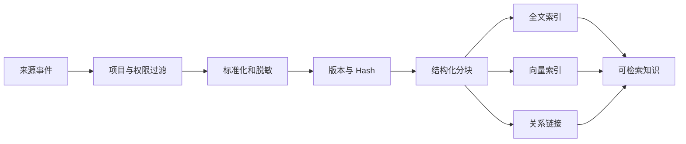

# Agent 平台知识库与项目记忆

## 目标

知识层为 Agent 提供可追溯的补充证据，但不得改变权威来源的优先级。Issue 明确引用的 Confluence 页面仍是需求权威；历史 Issue、MR、事故和 Agent 推断只能作为补充。

## 数据源

- Confluence 页面和嵌入附件。
- GitLab Issue、MR、Pipeline 和代码评审记录。
- 仓库内 README、架构文档、API 契约和迁移文件。
- 已批准的 Requirement、PRD、Test 和 Architecture Artifact。
- 已批准的 SDD 微服务变更设计，以及合并后按 Commit SHA 固化的实际影响。
- Quality Finding、发布验证、回滚和 Incident。
- 经过 Engineer Approval 的项目记忆。

## 可信等级

| 等级 | 含义 |
|---|---|
| AUTHORITATIVE | 当前 Workflow 指定的权威来源 |
| APPROVED | 经过有效 Engineer Gate 的决策或产物 |
| VERIFIED | 来源和版本可验证，但不是当前权威需求 |
| HISTORICAL | 历史记录，仅用于参考 |
| INFERRED | Agent 生成的推断或摘要 |
| UNTRUSTED | 尚未验证的外部或用户内容 |

Context Builder 必须按等级排序，并在冲突时优先展示冲突而不是自动选择低等级内容。

## 摄取流程


```mermaid
flowchart LR
    S["来源事件"] --> F["项目与权限过滤"]
    F --> N["标准化和脱敏"]
    N --> V["版本与 Hash"]
    V --> C["结构化分块"]
    C --> T["全文索引"]
    C --> E["向量索引"]
    C --> L["关系链接"]
    T --> M["可检索知识"]
    E --> M
    L --> M
```

分块必须保留父文档、标题路径、来源版本、Commit SHA、内容 Hash、权限范围和时间信息。密钥、Token、未脱敏个人信息不得进入索引。

## Hybrid RAG

第一版使用 PostgreSQL Full Text Search、pgvector 和元数据过滤。检索流程为：

1. 根据项目、模块、来源类型、时间和可信等级过滤。
2. 并行执行稀疏和向量检索。
3. 使用 Reciprocal Rank Fusion 合并。
4. 可选 Reranker 重排。
5. 验证来源仍可访问且版本未被撤销。
6. 将被选结果写入 Context Manifest。

Agentic RAG 最多允许有限轮查询改写。每轮保存查询、结果、选择原因和停止原因。

当前实现最多执行两轮：第一轮使用原始查询，第二轮仅删除原查询中的会话填充词、去重并截断，不允许生成来源中不存在的新术语。每轮通过 `parent_run_id`、`iteration`、`rewritten_from`、`selection_reason` 和 `stop_reason` 重放；未选 Chunk 记录排除原因。

超过单来源 Context 上限时采用确定性的首尾抽取压缩。原始快照与 Hash 保持不变，Context Entry 保存实际传输内容 Hash、`extractive-head-tail-v1` 方法及原始来源 Hash，压缩结果不能覆盖权威原文。

## 可运行检索流水线

知识摄取现在按 `ParseDocument -> NormalizeText -> ChunkDocument -> EmbedDocuments` 执行。Markdown/HTML 标题路径会进入 Chunk 元数据；中文本地回退向量使用字符与双字特征，长中文章节不会再退化为单个 Chunk。每个知识版本保存 Parser/Cleaner 版本，每个 Chunk 保存 Chunker/Embedding 模型版本。

默认 Embedding 是可重放的本地实现。测试环境可配置一个经过批准、兼容 OpenAI `/embeddings` 协议的凭据隔离服务：

```text
RAG_EMBEDDING_URL=http://ai-sdlc-factory-agent-runtime:8090
RAG_EMBEDDING_MODEL=<approved-model-version>
RAG_EMBEDDING_TOKEN=<agent-runtime-shared-secret>
```

索引和在线查询必须使用相同模型版本以及 64 维输出。切换模型时应构建新索引、运行版本化评测集，再通过治理流程激活，不能原地改写旧版本的审计证据。

在线路径执行 `UnderstandQuery -> lexical/vector recall -> RRF -> Reranker -> authority/diversity/token-budget selection`。最终补充知识使用 `K-NNN` Evidence ID 写入 Context Manifest。模型只能返回本次 Context 中存在的 Citation ID；伪造 ID 会使 Agent Run 失败。

`rag_evaluation_cases` 和 `rag_evaluation_results` 保存版本化离线数据集与 Recall@K、MRR、nDCG、引用和无依据声明指标。跨项目泄露、撤销来源命中和伪造引用必须保持为零，才能进入 Canary。

## SDD 服务影响知识

Architecture Gate 通过后，SDD Agent 将每个已批准工作项拆为结构化服务影响：微服务、仓库、变更类型、功能点、组件/API/数据变化、预计文件路径、验收标准、验证方式和风险。Engineer SDD Gate 通过后，这些记录以 `planned_impacts` 激活；旧版本只会标记为 `SUPERSEDED`，不会覆盖历史证据。

Merge Request 合并时，系统按精确 Commit SHA 读取变更文件，将其与预计路径逐服务比对并写入 `actual_impacts`。实际影响同时以 `ACTUAL_IMPACT` 来源进入 RAG。因此后续需求分析可以检索“某微服务历史上为哪些功能改过什么”，也能区分计划设计、实际落地和架构偏差。

## 本体层与图谱扩展

本体层位于结构化影响知识与 Hybrid RAG 之间。它把 Service、Feature、Component、API、Data Entity、Repository、Code Path、Work Item、Acceptance Criterion、Merge Request 和 Commit 保存为项目范围内的规范实体，并将 `CHANGES`、`IMPLEMENTS_FEATURE`、`EXPOSES`、`OWNS_DATA`、`LOCATED_AT`、`VERIFIED_BY`、`MR_IMPLEMENTS` 和 `MODIFIES` 保存为有向关系。

只有通过 SDD Gate 的设计关系才能以 `APPROVED` 权威等级激活；MR/Commit 产生的关系以 `VERIFIED` 激活。每个实体修订和关系都保存来源、来源版本、内容 Hash、可信等级及有效时间，Agent 推断不能绕过 Gate 直接成为事实。

在线检索先按原查询进行实体链接，再从命中的 Active 实体进行项目内一跳关系扩展。扩展词只用于原有最多两轮检索中的第二轮，随后仍经过 lexical/vector recall、RRF、Rerank、权限和可信等级过滤，并完整写入 Retrieval Run 的过滤条件以便重放。

## 项目记忆

项目记忆是受治理的工程知识，不是自由形式聊天历史。类型包括：

- 架构决策。
- 业务规则。
- 模块 Owner。
- 开发与测试约束。
- 部署与回滚约束。
- 事故经验。
- 已批准的 Reviewer 规则。

生命周期：

```text
CANDIDATE -> REVIEW_REQUIRED -> ACTIVE -> SUPERSEDED / EXPIRED / REVOKED
```

所有 Active Memory 必须有来源。对安全、权限、业务语义和生产操作有影响的 Memory 必须由 Engineer 批准。Agent 可提出候选，但不能激活或延长有效期。

## 删除与保留

- 不可变审计证据按现有审计策略保留。
- 搜索索引是可重建派生数据，可按来源撤销或重建。
- Memory 撤销后不从审计中物理删除，但不能再进入新 Context。
- 数据源权限变化后应触发索引权限更新和 Context 缓存失效。
