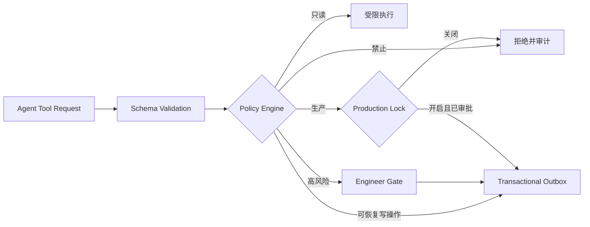

# V3 安全设计

V3 继承现有安全边界，并针对 RAG、多 Agent、MCP、记忆和持续改进增加额外控制。

## 信任边界

- Confluence、GitLab、代码注释、附件、检索结果、Agent 输出和 MCP 返回均为不可信数据。
- 只有 Factory Policy、项目配置和有效 Engineer Gate 能授予权限。
- Agent Runtime 不持有工作流数据库写权限和高风险外部凭据。
- Secret 永不进入 Prompt、Context Manifest、队列 Payload、审计详情或评测数据。

## Prompt Injection 防护

- 权威来源与系统指令使用不同结构字段传递。
- Context Entry 明确标记来源和可信等级。
- 从文档中提取的工具名称、URL 或命令不得自动执行。
- Agent 输出中的 Tool Request 必须通过独立 Schema 和 Policy 校验。
- RAG 摄取阶段执行敏感信息扫描和内容大小限制。
- 安全评测必须包含间接 Prompt Injection 和数据外泄测试。

## 工具授权

Policy 决策至少基于：项目、Agent Profile、Workflow State、工具版本、风险等级、Actor、证据版本和预算。工具不得仅凭模型文本说明获得权限。

## 多 Agent 隔离

- 不同 Agent Run 使用独立上下文和调用标识。
- Critic 不读取 Primary 的隐藏推理。
- Judge 只能读取正式结构化意见与证据。
- Agent 之间的消息必须经过 Schema 校验并持久化。
- 任一 Agent 的越权请求不会因为 Judge 接受其结论而合法化。

## 项目记忆安全

- Agent 只能创建 Candidate Memory。
- 权限、业务规则、生产约束和安全规则必须人工批准。
- Memory 必须有来源和作用域。
- 被撤销、过期或冲突的 Memory 不得进入新 Context。
- 不允许将 Secret、个人敏感信息或未经授权的跨项目数据写入 Memory。

## 评测与持续改进安全

- 评测环境不得获得生产写凭据。
- Shadow Run 禁止外部写操作。
- 自动改进只能生成候选，不能修改 Active 配置。
- Prompt、模型、Skill 和 Tool Policy 的激活都有独立审计记录。
- 生产部署和生产迁移继续保持默认关闭。

## 网络与运行时

- Agent Runtime 只允许访问已配置 Model Provider、MCP Gateway、PostgreSQL 和必要 DNS。
- MCP Server 按风险和凭据作用域隔离部署。
- 容器继续使用非 root、只读根文件系统、丢弃 Capability 和受限 ServiceAccount。
- Provider 和 MCP 响应设置大小、时间和重定向限制。
- Object Storage 中的证据使用项目级前缀和最小权限访问。

